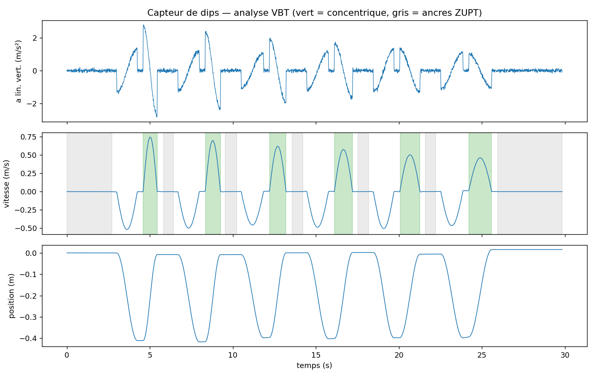
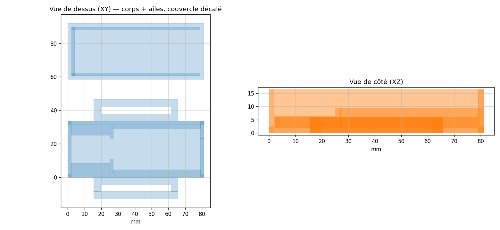

# Capteur de dips — capteur VBT open source pour le streetlifting

*Open-source velocity-based training (VBT) sensor for weighted dips — ESP32 + IMU.*

Un petit capteur fixé sur la ceinture lestée qui mesure la vitesse de chaque
rep de dips : vitesse moyenne et pic, amplitude, perte de vitesse dans la
série. De quoi piloter l'entraînement avec des données (arrêt de série au
seuil de perte de vitesse, estimation du 1RM sans tirer de max, jauge de
fraîcheur) au lieu du feeling.

Pourquoi ce projet : tous les capteurs VBT du marché sont pensés pour une
barre — appareil pincé sur la barre ou caméra qui suit le disque — et il
n'existe aucun capteur VBT open source maintenu, encore moins pour la
calisthénie lestée, où le corps bouge sous une charge qui pendule. Ce dépôt
comble ce trou, en commençant par les dips.



**État actuel (V1)** : chaîne d'analyse complète validée sur données
synthétiques — erreur moyenne de 2,3 % sur la vitesse moyenne, 0,8 % sur la
vitesse pic, 0,9 % sur l'amplitude, sur une série de 6 dips simulée avec
bruit, biais et oscillation de ceinture réalistes. Prochaine étape : la
validation sur le vrai matériel (~40 € : ESP32 + MPU6050).

## Architecture V1

L'ESP32 enregistre les mesures brutes de l'IMU à 100 Hz, tout le calcul de
vitesse se fait en Python sur PC. Quand l'algo sera figé et validé sur données
réelles, il sera porté en C++ sur la carte, avec retour temps réel (BLE,
vibreur).

## Contenu

- `firmware/capteur_dips_v1/` — croquis Arduino pour l'ESP32 : lit le MPU6050 à
  100 Hz, calibre le gyro au démarrage (2 s immobile, LED allumée), streame en
  CSV sur le port série. Registres écrits à la main, sans bibliothèque MPU (on
  voit passer la datasheet, c'est le but).
- `firmware/capteur_dips_v2_ble/` — V1 + streaming **BLE** (paquets binaires de
  5 échantillons, ~20 notifications/s) pour couper le câble USB : capteur sur
  batterie, capture sans fil via `analyse/capture_ble.py` (pip install bleak).
  La sortie série reste active en parallèle. L'algo embarqué + le retour
  vibreur viendront en V3.
- `analyse/generateur_reps.py` — fabrique une fausse séance de 6 dips avec
  fatigue, vue par un MPU6050 virtuel (inclinaison, oscillation de ceinture,
  bruit, biais). Permet de développer SANS le matériel.
- `analyse/analyse_reps.py` — l'algo : détection d'immobilité, calibration,
  suivi de gravité (filtre complémentaire), intégration avec ZUPT et correction
  de dérive, découpage en reps, métriques VBT (v moyenne, v pic, ROM, perte de
  vitesse). Sort un tableau + un graphique de contrôle.
- `analyse/capture_serie.py` — enregistre le flux série du vrai capteur dans un
  CSV (nécessite `pip install pyserial`).
- `boitier/generer_boitier.py` — génère le boîtier imprimable en 3D
  (`boitier_capteur_v1.stl`) : carte + GY-521 montés rigides, ailes à fente
  pour la sangle de la ceinture, échancrure USB, couvercle à friction. Toutes
  les cotes sont paramétrables en tête de script — à la livraison, mesurer la
  carte au pied à coulisse, ajuster `L_CARTE`/`l_CARTE`, relancer.

## Boucle de dev sans matériel (dispo tout de suite)

```
cd analyse
python generateur_reps.py
python analyse_reps.py reps_simulees.csv --verite verite_terrain.json
```

Le second script imprime les reps détectées et l'erreur par rapport à la vérité
terrain simulée — c'est le banc de test de l'algo.

## Quand le matériel arrive

1. Câbler le GY-521 : VCC→3V3, GND→GND, SDA→GPIO21, SCL→GPIO22.
2. IDE Arduino : ajouter l'URL des cartes ESP32 dans Préférences
   (`https://espressif.github.io/arduino-esp32/package_esp32_index.json`),
   installer « esp32 » dans le gestionnaire de cartes, choisir
   « ESP32 Dev Module », port série à 115200.
3. Flasher `firmware/capteur_dips_v1`, laisser le capteur immobile pendant la
   calibration (LED allumée ~2 s).
4. Capturer une séance : `python capture_serie.py --sortie seance.csv`
   (rester immobile 2-3 s au début, marquer une vraie pause en haut entre les
   reps — ce sont les ancres qui annulent la dérive).
5. Analyser : `python analyse_reps.py seance.csv`.

## Impression du boîtier

PLA ou PETG (rigide = mesure propre ; garder le TPU pour plus tard si le
confort le demande), 0,2 mm, 3 périmètres, 20 % de remplissage, **sans
support** — tout est dessiné pour. Le STL contient le corps et le couvercle
côte à côte ; si le slicer signale des coques qui se chevauchent, c'est
normal (géométrie additive), il les fusionne tout seul. Monter le GY-521 à
plat entre ses cales (barrette soudée vers le HAUT), 4 fils Dupont F-F vers
la carte par le passage central, un point de colle chaude ou de la mousse
sous la carte pour caler. Si le couvercle force sur les broches de la carte,
réduire `h_j` (hauteur de jupe) dans le script. L'orientation du capteur dans
le boîtier n'a aucune importance : l'algo retrouve la direction de la gravité
tout seul.



## Feuille de route

- [x] Algo complet testé sur données synthétiques
- [x] Boîtier V1 imprimable généré (PLA/PETG, sans support)
- [ ] Flasher sur ESP32 réel et capturer de vraies séries
- [ ] Valider sur vraies reps (vidéo 240 fps comme vérité terrain)
- [ ] Re-régler les seuils (`SEUIL_*` en tête d'analyse_reps.py) sur le réel
- [ ] Porter l'algo en C++ sur l'ESP32 + retour BLE/vibreur
- [ ] Version force : cellule de charge dans la chaîne (protocole BLE Tindeq
  Progressor pour la compatibilité avec l'écosystème existant)
- [ ] Mode barre (le même capteur sanglé sur une barre : cas plus simple)

## Licence

[MIT](LICENSE) — utilise, modifie, partage. Si tu construis le tien, raconte.
